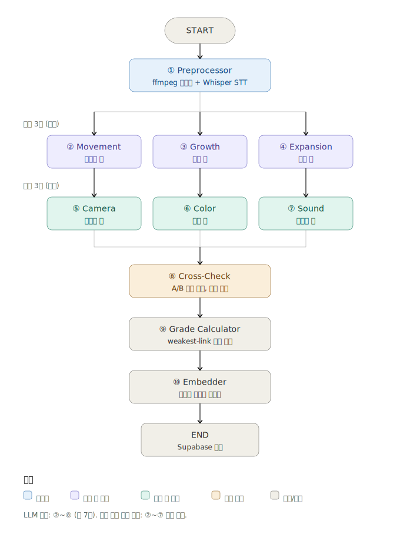

# 아키텍처

CentLens는 LangGraph 기반 멀티에이전트 시스템이다. 6축 평가의 축 독립성을 보장하고 병렬 실행으로 처리 시간을 단축하는 것이 핵심 설계 결정이다.

---

## 노드 다이어그램



---

## 왜 멀티에이전트인가

### 단일 호출의 문제

같은 프롬프트에 6축을 한 번에 묻는 단일 호출 방식은 두 가지 편향을 일으킨다.

**1. 일관성 편향 (Consistency Bias)**

LLM은 한 번의 출력에서 일관된 톤을 유지하려 한다. "이 영상은 움직임이 강하다"고 판단한 직후 카메라 축을 평가할 때, 카메라도 비슷한 점수로 맞추려는 경향이 생긴다.

**2. Position Bias**

프롬프트에서 먼저 등장하는 축이 뒤 축에 영향을 준다. 첫 번째로 평가한 축의 점수가 anchor 역할을 하여 뒤 축들이 그 주변으로 수렴한다.

### 멀티에이전트의 해결

**축 독립성**: 각 Judge 노드는 자기 축만 본다. 다른 축의 점수나 근거가 컨텍스트에 들어가지 않는다.

**A/B 양방향 교차 채점**: Cross-Check 노드가 1차 채점(A: 움직임→사운드 순)과 2차 채점(B: 사운드→움직임 역순)의 평균을 산출. Position Bias 제거.

**병렬 실행**: 6개 Judge 노드가 LangGraph의 병렬 분기로 동시 실행. 1편당 처리 시간 12~18초 → 3~5초로 단축.

---

## 노드별 상세 명세

### ① Preprocessor

**역할**: 영상 → 프레임 5장 + STT 텍스트

**입력**: `video_path`

**출력**: `frames` (이미지 경로 5개), `script` (Whisper STT 결과)

**처리**:
1. ffmpeg로 영상 길이 측정
2. 5개 시점에서 프레임 추출 (0% / 5% / 25% / 50% / 95%)
3. Whisper API 호출로 나레이션 추출 (영상이 1MB 이상일 때만)

**LLM 호출**: ❌

---

### ② ~ ⑦ Judge 노드 (6개)

**역할**: 자기 축만 평가

**공통 패턴**:

```python
async def {axis}_judge_node(state: CentLensState) -> dict:
    response = await claude_client.messages.create(
        model="claude-sonnet-4-5",
        messages=[{
            "role": "user",
            "content": [
                {"type": "image", "source": ...},  # 프레임 5장
                {"type": "text", "text": prompt.format(
                    genre=state["genre"],
                    script=state["script"]
                )}
            ]
        }]
    )
    return {f"{axis}_a": parse_json(response)}
```

**입력 차별화**:

| 노드 | 사용 입력 |
|---|---|
| Movement Judge | 프레임 + 스크립트 |
| Growth Judge | 프레임 + 스크립트 |
| Expansion Judge | 프레임 + 스크립트 |
| Camera Judge | 프레임만 |
| Color Judge | 프레임만 |
| Sound Judge | 스크립트 + 프레임 |

**LLM 호출**: 각 1회 (총 6회 병렬)

---

### ⑧ Cross-Check

**역할**: A/B 양방향 교차 채점, Position Bias 제거

**입력**: 1차 채점 결과 6축 (`movement_a` ~ `sound_a`)

**처리**:
1. **B채점 호출** — 같은 영상에 대해 축 순서를 반대로 섞어 재채점
   - A채점 순서 (Judge 노드들이 사용한 순서): 움직임→성장→확장→카메라→컬러→사운드
   - B채점 순서 (역순): 사운드→컬러→카메라→확장→성장→움직임
2. **평균값 산출** — A점수와 B점수의 평균을 최종 점수로 사용
3. **근거 텍스트** — A 채점의 근거 텍스트 사용 (B 채점은 점수 검증용)

**출력**: `movement_final` ~ `sound_final` 6축 최종 점수

**LLM 호출**: 1회

---

### ⑨ Grade Calculator

**역할**: weakest-link 등급 산출

**입력**: 6축 최종 점수

**처리**: LLM 호출 없이 수식 계산

```python
def grade_calculator_node(state):
    scores = {axis: state[f'{axis}_final']['score']
              for axis in AXES}
    min_score = min(scores.values())
    total = sum(scores.values())
    weakest = min(scores, key=scores.get)

    if min_score >= 4 and total >= 24:
        grade = 'strong'
    elif min_score >= 3 and total >= 18:
        grade = 'medium'
    else:
        grade = 'weak'

    return {'grade': grade, 'weakest_axis': weakest, 'total_score': total}
```

**LLM 호출**: ❌

---

### ⑩ Embedder

**역할**: 시맨틱 검색용 임베딩 생성

**입력**: 6축 최종 점수 + 근거 텍스트 + 메타데이터

**처리**:
1. 6축 근거 텍스트를 합쳐 하나의 문서로 구성
2. OpenAI text-embedding-3-small 호출
3. 1536차원 벡터를 Supabase pgvector에 저장

**텍스트 포맷**:
```
[게임명] [장르] [등급]
움직임: {rationale}
성장: {rationale}
확장: {rationale}
카메라: {rationale}
컬러: {rationale}
사운드: {rationale}
```

**LLM 호출**: ❌ (Embedding API 호출)

---

## State 흐름

```
입력: video_path, category, game_name, genre
  ↓
① Preprocessor → frames, script
  ↓ (병렬 분기)
②~⑦ Judge → movement_a, growth_a, ..., sound_a
  ↓ (합류)
⑧ Cross-Check → movement_final, ..., sound_final
  ↓
⑨ Grade Calculator → grade, weakest_axis, total_score
  ↓
⑩ Embedder → embedding
  ↓
END → Supabase 저장
```

---

## 처리 시간 비교

### 단일 호출 방식 (가상)

```
프레임 추출 (1초) → STT (3초) → 6축 동시 채점 (8초) → 등급 (즉시) = 약 12초
```

### 멀티에이전트 (실제)

```
프레임 추출 (1초) → STT (3초) → 6축 병렬 채점 (3초, max) → 교차 채점 (3초)
                                                              → 등급 + 임베딩 (1초) = 약 11초
```

처리 시간은 비슷하지만, 멀티에이전트는:
- 축 독립성 보장
- A/B 교차로 점수 신뢰도 향상
- 노드별 디버깅 가능
- 확장성 (새 축 추가 시 노드만 추가)

---

## 확장 로드맵

### v2: 사후 성과 연결

집행된 영상의 실제 CPI/IPM/D1 retention/ROAS 결과가 들어오면 AI 사전 등급과 비교:

- **⑪ Performance Linker 노드** 추가
- 진단 정확도 누적 측정
- 루브릭 가중치 자동 튜닝

### v3: 트렌드 학습

매주 글로벌 탑 크리에이티브를 자동 분해하고, 자사 영상과 비교:

- **⑫ Competitive Analyzer 노드** 추가
- 트렌드 변화 추적
- 자사 영상이 트렌드와 얼마나 정렬되어 있는지 측정

---

## 다음 문서

→ [화면 설계](wireframes.md)
